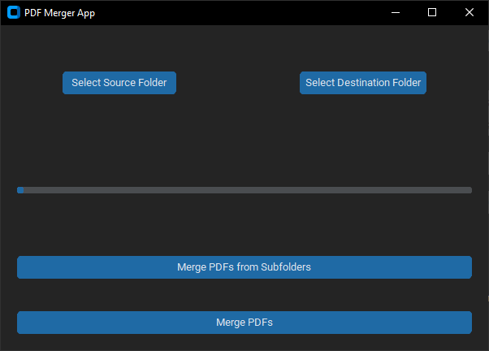

# PDF MergePro



## Overview

PDF MergePro is a Python-based application designed to simplify the process of merging multiple PDF files into a single document. Whether you're consolidating reports, combining chapters of an eBook, or organizing invoices, PDF MergePro offers a user-friendly solution with advanced features.

## Features

- **Merge PDF Files**: Combine multiple PDF files into a single PDF document.
- **Merge PDFs from Folders**: Merge PDFs located within a selected source folder.
- **Merge PDFs from Subfolders**: Merge PDFs from subfolders within a selected source folder.
- **Progress Tracking**: Visualize merge progress with a dynamic progress bar.
- **Customizable Interface**: Choose between different appearance modes ("System", "Dark", "Light") and color themes ("blue", "green", "dark-blue").
- **Cross-Platform**: Runs on Windows, macOS, and Linux.

## Prerequisites

- Python 3.x installed on your system.

## Installation

1. Clone the repository:
   ```bash
   git clone https://github.com/yourusername/pdf-merge-pro.git
   cd pdf-merge-pro

2. Install the required dependencies:
   ```bash
   pip install -r requirements.txt

3. Run the application:
   ```bash
   python pdf_merge_app.py

## Usage

- Select a source folder containing PDF files by clicking "Select Source Folder".
- Choose a destination folder where the merged PDF file will be saved by clicking "Select Destination Folder".
- Click the "Merge PDFs" button to initiate the merging process. Optionally, use "Merge PDFs from Subfolders" for merging PDFs located within subfolders of the selected source folder.
- Monitor the progress of the merge operation using the progress bar.
- Once completed, a success message will indicate that the PDF files have been merged successfully.

## Creating an Executable (Optional)

You can create an executable file (.exe) to easily share PDF MergePro with others who may not have Python installed. Follow these steps:

1. Open a PowerShell or Command Prompt in the directory where your Python code (`pdf_merge_app.py`) exists.

2. Run the following command:
   ```powershell
   pyinstaller --onefile --noconsole pdf_merge_app.py --collect-all customtkinter -w

3. After the process completes, you will find the generated .exe file in the `dist` folder within your project directory.
